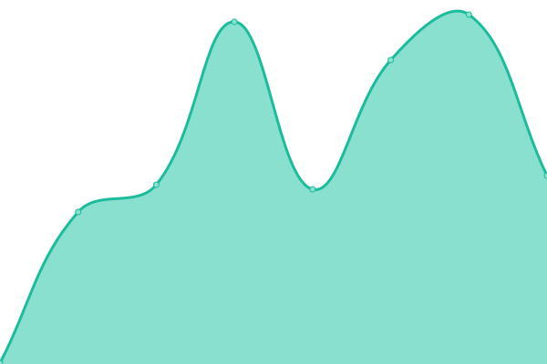

# [📈 Live Status](https://kripeshWeb.github.io/UpTime): <!--live status--> **🟧 Partial outage**

This repository contains the open-source uptime monitor and status page for [kripesh mainali](https://kripeshWeb.github.io/UpTime), powered by [Upptime](https://github.com/upptime/upptime).

With [Upptime](https://upptime.js.org), you can get your own unlimited and free uptime monitor and status page, powered entirely by a GitHub repository. We use [Issues](https://github.com/kripeshWeb/UpTime/issues) as incident reports, [Actions](https://github.com/kripeshWeb/UpTime/actions) as uptime monitors, and [Pages](https://kripeshWeb.github.io/UpTime) for the status page.

<!--start: status pages-->
<!-- This summary is generated by Upptime (https://github.com/upptime/upptime) -->
<!-- Do not edit this manually, your changes will be overwritten -->
<!-- prettier-ignore -->
| URL | Status | History | Response Time | Uptime |
| --- | ------ | ------- | ------------- | ------ |
|  [rdp](https://6070-cs-e021a539-8589-4477-a295-7bcd566fd30e.cs-asia-southeast1-palm.cloudshell.dev/?authuser=7&redirectedPreviously=true) | 🟥 Down | [rdp.yml](https://github.com/kripeshWeb/UpTime/commits/HEAD/history/rdp.yml) | 

 750ms
     
 | 

<a href="https://kripeshWeb.github.io/UpTime/history/rdp">0.00%</a>
    

|  [kripeshmainai](https://www.kripeshmainali.com.np) | 🟩 Up | [kripeshmainai.yml](https://github.com/kripeshWeb/UpTime/commits/HEAD/history/kripeshmainai.yml) | 

 300ms
     
 | 

<a href="https://kripeshWeb.github.io/UpTime/history/kripeshmainai">100.00%</a>
    

<!--end: status pages-->

[**Visit our status website →**](https://kripeshWeb.github.io/UpTime)

## 📄 License

- Powered by: [Upptime](https://github.com/upptime/upptime)
- Code: [MIT](./LICENSE) © [Anand Chowdhary](https://anandchowdhary.com), supported by [Pabio](https://pabio.com)
- Data in the `./history` directory: [Open Database License](https://opendatacommons.org/licenses/odbl/1-0/)
